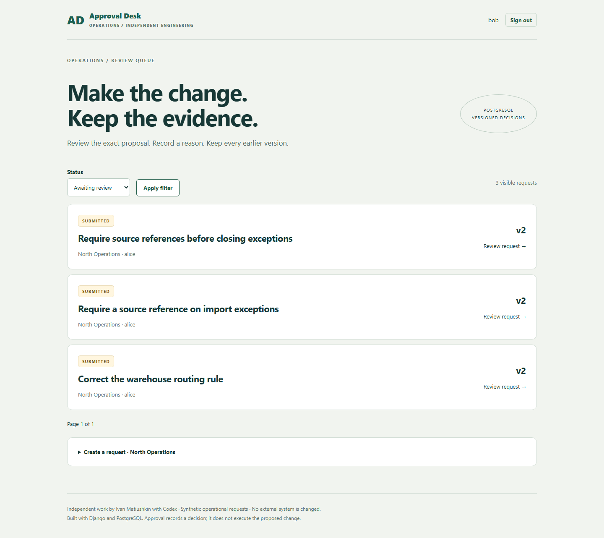

# Operations Approval Desk

[](https://github.com/Hadezu/operations-approval-desk/actions/workflows/verify.yml)

**Two reviewers open the same request. One approves it. The other rejects the old version. Which decision survives?**

A runnable Django/PostgreSQL internal tool: scoped accounts, an operational review queue, exact-version decisions, preserved proposal history and downloadable evidence. The second stale decision is rejected instead of silently overwriting the first.

Independent engineering work by **Ivan Matiushkin with Codex**. All examples are synthetic. Approval changes this application's workflow record only; it does not execute a warehouse, import or financial operation.



[Market fit and case study](docs/CASE-STUDY.md) · [Architecture and boundaries](docs/ARCHITECTURE.md) · [Verification](docs/VERIFICATION.md) · [Portfolio/email wording](docs/COMMERCIAL-USAGE.md)

## What a reviewer can verify

There is also a **guided EN/PL public-demo mode**: isolated 20-minute synthetic workspaces, role switching, real database decisions and evidence export, without a shared login. See [public-demo setup, free hosting candidate and limitations](docs/PUBLIC-DEMO.md). A deployment configuration is included; no live URL is claimed until hosting is verified.

| Situation | Observable behavior |
| --- | --- |
| User requests another team's record or evidence | HTTP 404, no record content |
| Requester guesses a colleague's request ID | HTTP 404; requesters see their own team's own requests |
| Reviewer submits their own proposal | Allowed, but they cannot approve or reject it |
| Two reviewers decide on the same version | One decision commits; the other receives HTTP 409 |
| Same command is delivered twice | Original receipt returned; no additional event/version |
| Same command key carries different content | Conflict; no mutation |
| Audit insert fails or process dies before commit | State and event both roll back |
| Rejected proposal is revised | New version; old proposal and rejection remain inspectable |
| Someone updates/deletes audit rows through ordinary SQL | Trigger rejects mutations; only expired disposable demo tenants permit deletion for cleanup |
| Approved proposal is edited | Transition rejected; approved requests are closed |

This strengthens the existing [Workflow & Access](https://work.matiushkin.com/en/workflow-access) and internal-tools service. It adds real authenticated writes and database behavior to the portfolio's scenario-based permission proof. It is not a new service category or a claim of paid Django delivery history.

## Run with Docker Compose

Requires Python 3 to generate private configuration and Docker Compose v2. No external API, account, paid service or email delivery.

```sh
python scripts/configure.py
docker compose up -d --build
docker compose exec web uv run --no-dev python manage.py seed_demo
```

Wait for `http://127.0.0.1:8187/health/` to return `{"status":"ok"}` before seeding. Open **http://127.0.0.1:8187/**. Read the generated **DEMO_PASSWORD** from your local `.env`; all five demo accounts use it. The generator refuses to overwrite `.env`, and the seed refuses to replace an existing application. Do not publish this file.

| Account | Team | Role |
| --- | --- | --- |
| `alice` | North | Requester: own requests |
| `bob`, `carol` | North | Reviewers: team queue, never own decisions |
| `dana` | North | Auditor: team read/export only |
| `eve` | South | Reviewer: separate team |

Restarting containers preserves PostgreSQL data. `docker compose down` stops the app. Adding `-v` deliberately deletes the demo database volume. Only the web port is published, on loopback.

## Run and test without Docker

Requires Python 3.12–3.14, uv 0.12.23 and a **disposable PostgreSQL database**. Set `PGHOST`, `PGPORT`, `PGUSER`, `PGPASSWORD`, `PGDATABASE=approval_desk`, `DJANGO_SECRET_KEY` and `DEMO_PASSWORD` in your process environment. `.env` is read by Compose; native commands do not load it automatically.

```sh
uv sync --locked
uv run python manage.py migrate
uv run python manage.py seed_demo
uv run python manage.py collectstatic --noinput
uv run python -m scripts.serve
```

In another terminal with the same environment:

```sh
uv run pytest -q --junitxml=test-results/unit.xml
uv run ruff check .
uv run ruff format --check .
uv run python manage.py makemigrations --check --dry-run
uv run playwright install chromium
uv run python scripts/browser_check.py
```

Django tests create/drop `test_approval_desk` and require database-creation privileges. The browser check writes additional **synthetic** requests to the seeded local application. It uses real password login, session cookies, CSRF, HTTP and PostgreSQL; it does not force-login through a test backdoor. Linux browser setup uses `playwright install --with-deps chromium`.

## Inspect the engineering

- `desk/services.py`: validation, scoped authorization, version checks and one atomic transition.
- `desk/models.py` and migrations: constraints, event snapshots and append-only trigger.
- `desk/views.py`: session/CSRF-protected commands, team-safe queries and evidence export.
- `tests/`: negative HTTP tests, real simultaneous database sessions, fault injection and a separately killed process.
- `scripts/browser_check.py`: actual multi-user acceptance and video recording.

Django provides authentication, sessions, CSRF, autoescaped templates, ORM and migrations. PostgreSQL provides transactions, locks and constraints. Our contribution is the workflow application, authorization policy, evidence model, tests, interface and handover. [Attribution](docs/ATTRIBUTION.md).

## Deliberate boundaries

This is an independent demonstration, not a SaaS or certified approval system. Classic password-login mode remains intended for local use. Public mode is a bounded synthetic sandbox with separate routes, quotas and expiry; see its [deployment boundaries](docs/PUBLIC-DEMO.md). No SSO/MFA, external notifications, attachments, multi-stage approval builder, background execution, production backup/restore or load benchmark. Before real business use: separate migration/runtime database roles, identity hardening, operational monitoring and a deployment-specific security review are required.

The local setup uses one database owner for simplicity. The append-only trigger prevents ordinary update/delete; the database owner can disable it or alter data. Hashes are content fingerprints, not signatures. Team scope is enforced by application queries, not PostgreSQL row-level security. See the architecture document for concurrency and identity-administration boundaries.

[Portfolio](https://work.matiushkin.com/en) · [GitHub](https://github.com/Hadezu) · ivan@matiushkin.com

<details>
<summary>Technical verification recording</summary>

Original test recording retained as supporting evidence. For the scenario, results and limitations, see the verification documentation above.

[Download the original recording](docs/images/approval-demo.webm)

</details>
