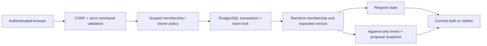

# Architecture and guarantees

## One application, one database

Django renders server-side HTML, accepts session/CSRF-protected commands and exports JSON. Waitress serves the local WSGI application; WhiteNoise serves collected CSS. PostgreSQL is mandatory: SQLite would not establish the locking behavior this case is intended to prove. There is no queue, cache, browser SPA, external integration or LLM because this scope does not require them.

## Identity and authorization

Each team membership has exactly one role. Requesters may see/edit/submit only their own requests in their team. Reviewers may read team requests and review someone else's submitted request, and may create their own proposals; they cannot review those themselves. Auditors read/export team records but cannot write. Superuser status does not bypass workflow roles. Account/membership administration is intentionally not exposed in the UI.

All detail, queue, mutation and export paths scope queries. Membership is read again after acquiring the workflow lock. `set_membership` takes the same team lock, so supported membership changes and workflow writes are serialized. Direct ORM/raw-SQL administration bypasses that protocol and is outside the concurrent-revocation guarantee. Active-user status is checked at execution; disabling an account is not a transactional cancellation of commands already in flight. Normal Django authentication invalidates future access by inactive users.

## State and version

`DRAFT → SUBMITTED → APPROVED | REJECTED`; only `REJECTED → DRAFT` can reopen a request. Draft edits, submissions, decisions and revision each increment the version. Every accepted command produces exactly one event with that result version, actor name/role at the time, reason, prior/next state, full proposal snapshot and SHA-256 content fingerprint.

Approved requests have no further transition. A rejected/revised request retains old snapshots. Versions count accepted actions, not just textual edits. Reasons are required (10–500 characters); titles/proposals have bounded lengths. Embedded HTML is displayed as text. The command body does not accept a caller-selected role, owner or state.

## Transaction and repeated requests

Commands serialize on their **team row**, including creation. This deliberately simple lock also coordinates membership changes. It trades per-team write throughput for a small, inspectable concurrency boundary. Different teams can proceed independently. There is a 5-second lock timeout and 15-second statement timeout; this is not a throughput claim.

Under the lock: recheck membership, resolve an existing command key, verify record visibility/owner/role, require the exact version/state, write the request and append its event. Commit or rollback covers both. A database failure returns 503 with a same-command retry instruction; no raw exception details are exposed.

Idempotency scope is `(team, actor, command UUID)`. A canonical fingerprint includes action, request UUID, expected version, reason and edited content. Same key/same content returns the original recorded result; different content conflicts. The receipt may describe an older version than the current request; it is not a claim that current state is unchanged. Authorization is checked before returning a receipt; revoked or read-only accounts cannot use replay to recover access. A new command key with an old version conflicts.

Tests use separate PostgreSQL connections to race approve/reject and duplicate delivery. Another test kills a child process after the request save but before event insert; PostgreSQL rolls back the uncommitted write on connection loss. In-process injected audit-write failure is tested separately. No network-partition, failover, backup durability or production SLA is inferred.

## Evidence boundary

The database rejects `UPDATE`/`DELETE` on events through a trigger. This is append-only behavior for ordinary writes, **not tamper-proof storage**: a database owner can disable triggers, truncate or fabricate records. The demonstration runtime/migrator shares an owner account. Production separation of privileges is not implemented here.

Content hashes make proposal equality inspectable, not authentic. They are not chained signatures. Event snapshots retain the actor's name/role at the decision even if membership later changes. Evidence export derives its head from the single event query, avoiding a separately read newer state paired with older history. This is a statement-consistent export, not a cryptographic attestation.

No business operation is executed after approval. No bank, CRM, email, warehouse or production file is changed. Request content and exported evidence may contain sensitive data in a real deployment; examples contain synthetic text only.
