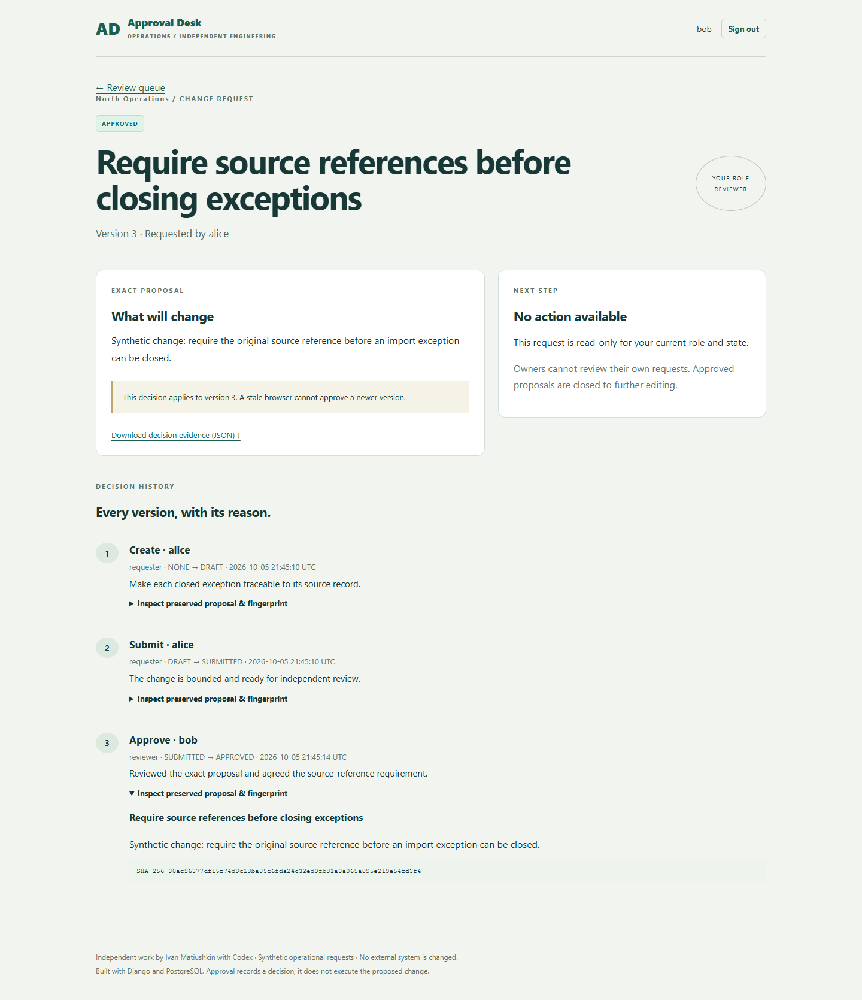

# Inspect the decision, not just the interface

[Actual recorded local demonstration](images/approval-demo.webm)

1. Log in as Alice. Create a bounded request with a specific reason and submit it. Alice can read the submitted version but cannot decide on it.
2. In separate browser profiles/private sessions, log in as Bob and Carol. Open the same submitted request in both.
3. Bob approves with a reason. The request becomes approved; the history now has create, submit and approve with preserved proposals.
4. In Carol's still-open form, reject it. The server returns HTTP 409/STALE_VERSION. The rejected attempt does not replace Bob's decision or append a successful event.
5. Inspect/export the history. A rejected request can be explicitly revised instead; earlier snapshots survive each new version.
6. Log in as Eve. North request URLs and evidence URLs return 404. As Dana, team evidence is visible but mutation is forbidden.

The short recording is the real automated browser journey; the guide above is a manual walkthrough. A separate database test races requests concurrently, rather than relying only on two sequential browser submissions. A separate process-death test verifies rollback. Browser traces are not published because authenticated traces can contain session credentials; the published video/screenshots contain synthetic content only.
