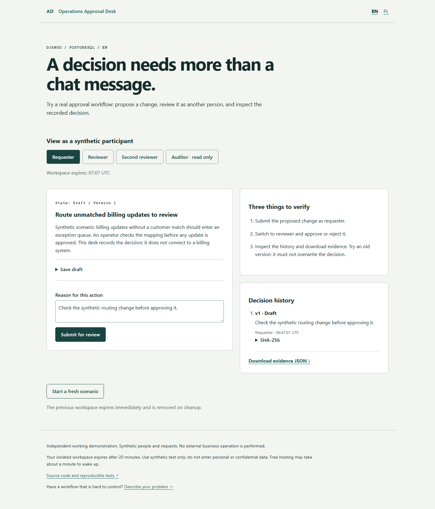

# Public guided demo verification — 2026-10-06

Base: `15276f84da9856e64dc88cca67e368a3f5d6ac58`.

## Local evidence

- Python 3.14 / Django 5.2.17 / PostgreSQL 18.6, actual local PostgreSQL; no SQLite substitute.
- 82 tests passed: 58 existing and 24 added. New coverage includes isolated tenants, real role enforcement, idempotent replay, independent concurrent starts, concurrent duplicate commands, expiry, scoped cleanup, protected audit rows, CSRF, quotas, injected database failure and retained escaped input.
- Django system check passed; migration drift check passed.
- Ruff lint and format checks passed after formatting.
- EN/PL at 1440px and 390px: real HTTP start → submit → reviewer approval → export → second-reviewer stale conflict → auditor read-only. No captured page exceptions or horizontal overflow. Screenshots manually inspected for desktop/mobile.
- Browser runner uses an isolated temporary verification database. It captures videos, screenshots and JSON under `test-results/public-browser/`. The CI workflow runs the same public journey alongside the existing classic-browser suite and container smoke.

[EN desktop recording](images/public-demo-en.webm) · [PL mobile recording](images/public-demo-pl-mobile.webm)

No performance/load benchmark, physical iPhone/Safari test, penetration test or production availability claim is made. Automated flows run Chromium; permission/isolation claims are also exercised through real database and HTTP tests.

## Deployment state

Render Free + Neon Free selected as a candidate. Account dashboards required sign-in during this run. `render.yaml` and the runbook are prepared; **live deployment has not been verified**. No paid plan was enabled, no customer data used and the portfolio production site was not changed by this increment. GitHub publication and CI status are reported separately from runtime availability.
